## Technologies used

## Mobile Design

# Mobile Prototype App

Mobile prototype application to be used by the users of a travel agency. It works alongside the web application, as this application will get all the information from the web application's API.

The mobile application implements these main modules:

- __Login__: The user must log in with credentials to access the application.

  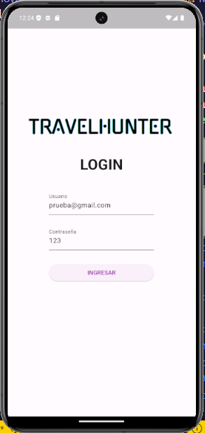
---
- __User's Module__: Shows the user's information and allows the user to update it.

  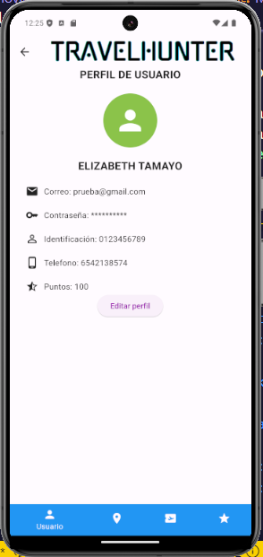
  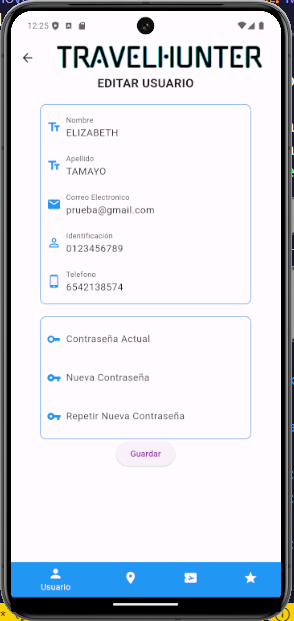
---
- __Trips Module__: Shows the trips the user has taken and the active trip if there is one.

  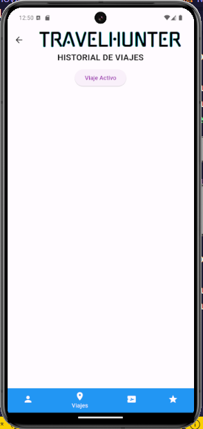
  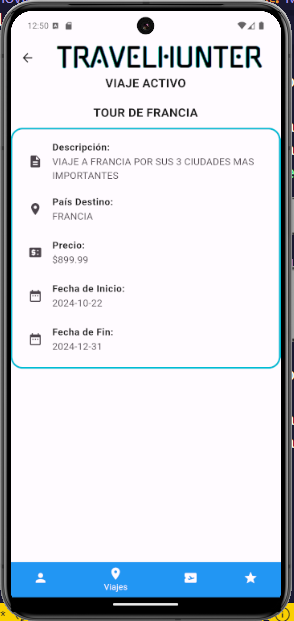
  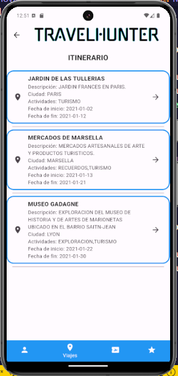
  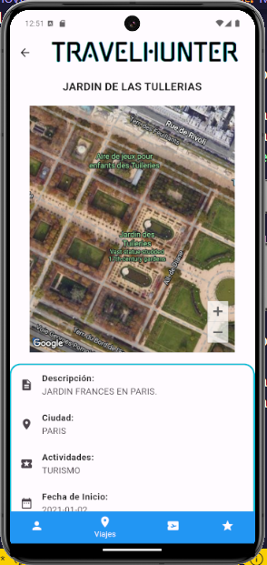
---
- __Products Module__: Shows the products offered by the travel agency and allows the user to send an appointment to the travel agency through mail.

  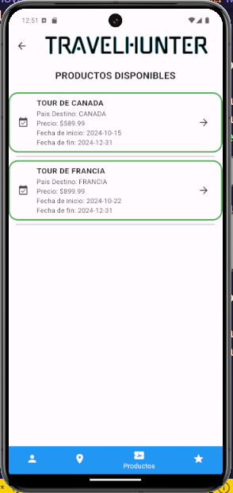
  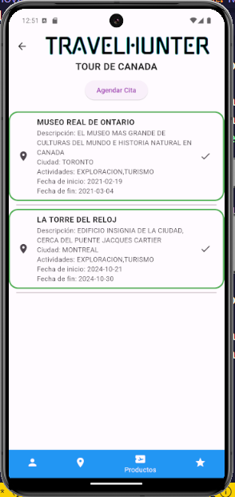
  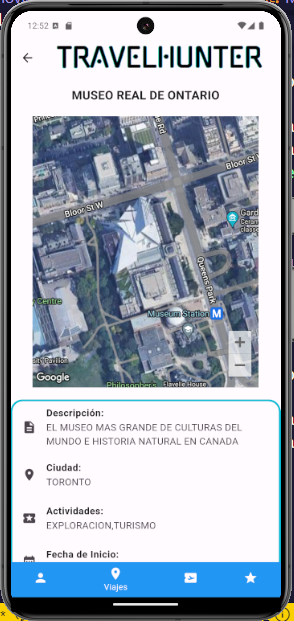
  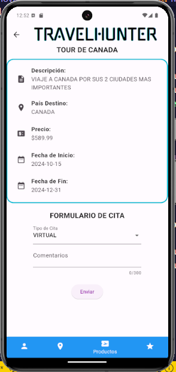
---
- __Benefits Module__: Shows the benefits offered by the travel agency by completing different gamified activities inside the application.

  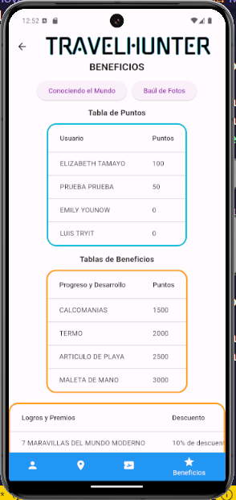
  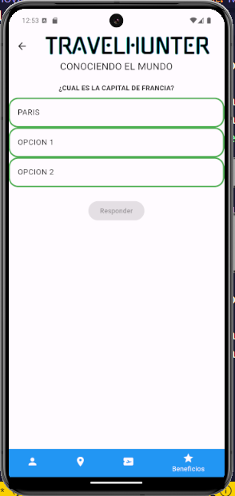
  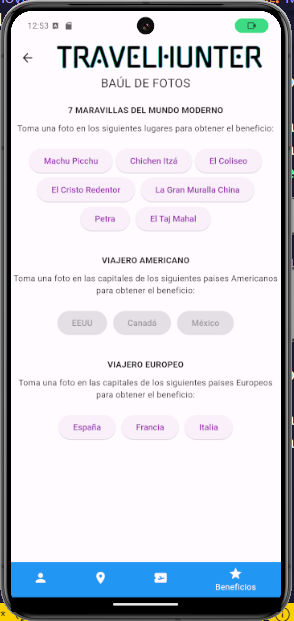
  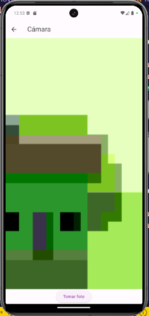
---

This application makes use of the Google Maps API to show the specific location of each place of a trip.

There is also a gamified module that allows the user to get benefits by completing different interactions inside the application.
- __Progress Benefits__: The user will get points by answering questions about the country they are visiting. The user will get a benefit when they reach a certain amount of points.
- __Achievements Benefits__: The user must take a picture of an specific place set by the travel agency. The user will get a benefit when the travel agency validates the picture.

The web application developed in Django can be found in this [repository](https://github.com/ElyRiven/Prototipo-Web-Proyecto).